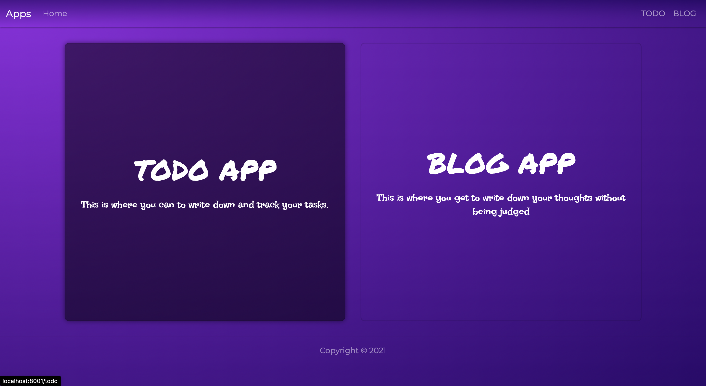

# **Full Stack Journey**

## **React** (Gatsby) & **Python** (Django - Graphene)

This is basically my first app using the two stacks

<figure>
    
    <figcaption>Home Page</figcaption>
</figure>

#

`Copyright 2021 - Nolan Kgotso`
